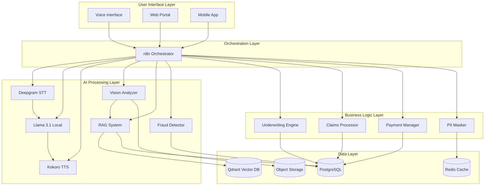

# Design Document: AI Voice-First Two-Wheeler Insurance Platform

## Overview

This design describes an AI-powered, voice-first insurance platform for the Indian two-wheeler market. The system consists of three main subsystems:

1. **Voice-Based Insurance Purchase Flow**: Multilingual voice interface for policy purchase with AI underwriting
2. **Automated Claims Processing**: Computer vision-based damage assessment with RAG-powered decision making
3. **Workflow Orchestration**: n8n-based orchestration coordinating all components

The architecture prioritizes privacy (local LLM processing, PII masking), explainability (RAG-based reasoning), and automation (90% target) while achieving sub-1-hour claim processing.

**Technology Stack:**
- Speech-to-Text: Deepgram
- Reasoning: Llama 3.1 (locally hosted)
- Text-to-Speech: Kokoro TTS
- Orchestration: n8n
- Computer Vision: Custom CNN model (ResNet-50 backbone)
- RAG: Vector database (Qdrant) + embedding model (sentence-transformers)
- Storage: PostgreSQL (structured data), S3-compatible (photos/documents)

## Architecture

### High-Level Architecture



### Component Interaction Flow

**Insurance Purchase Flow:**
```
User Voice → Deepgram STT → PII Masker → Llama 3.1 → 
Underwriting Engine → RAG (policy templates) → 
Policy Generator → Kokoro TTS → User
```

**Claims Processing Flow:**
```
User Photos → Vision Analyzer → Damage Report → 
RAG (policy clauses + tariffs) → Claims Processor → 
Fraud Detector → ATR Generator → Garage Notification → 
Payment Manager
```

## Components and Interfaces

### 1. Voice Interface Module

**Responsibilities:**
- Manage multilingual voice conversations
- Coordinate STT, LLM, and TTS components
- Maintain conversation context and state
- Handle voice session lifecycle

**Key Interfaces:**

```typescript
interface VoiceSession {
  sessionId: string;
  userId: string;
  language: LanguageCode;
  state: ConversationState;
  context: ConversationContext;
  startTime: Date;
  lastActivity: Date;
}

interface VoiceInterfaceService {
  // Start a new voice session
  startSession(userId: string, language: LanguageCode): Promise<VoiceSession>;
  
  // Process audio input and return audio response
  processAudio(sessionId: string, audioData: Buffer): Promise<AudioResponse>;
  
  // End session and cleanup
  endSession(sessionId: string): Promise<void>;
  
  // Get supported languages
  getSupportedLanguages(): LanguageCode[];
}

interface AudioResponse {
  audioData: Buffer;
  transcript: string;
  intent: Intent;
  nextAction: string;
}

type LanguageCode = 'hi' | 'en' | 'ta' | 'te' | 'bn' | 'mr' | 'gu' | 'kn' | 'ml' | 'pa';

interface ConversationContext {
  collectedData: Record<string, any>;
  currentStep: string;
  pendingQuestions: string[];
}
```

**Integration Points:**
- Deepgram API for STT (cloud service with PII masking)
- Local Llama 3.1 inference server (HTTP API)
- Kokoro TTS engine (local service)
- n8n webhooks for workflow triggers

### 2. PII Masking Service

**Responsibilities:**
- Identify PII in text and structured data
- Mask/tokenize PII before cloud processing
- Maintain secure mapping for unmasking
- Encrypt PII at rest

**Key Interfaces:**

```typescript
interface PIIMasker {
  // Mask PII in text before sending to cloud
  maskText(text: string): Promise<MaskedText>;
  
  // Unmask text using token mapping
  unmaskText(maskedText: MaskedText): Promise<string>;
  
  // Mask structured data
  maskData(data: Record<string, any>): Promise<MaskedData>;
  
  // Unmask structured data
  unmaskData(maskedData: MaskedData): Promise<Record<string, any>>;
}

interface MaskedText {
  maskedContent: string;
  tokenMap: string; // Encrypted token mapping ID
}

interface MaskedData {
  maskedContent: Record<string, any>;
  tokenMap: string;
}

enum PIIType {
  NAME = 'name',
  PHONE = 'phone',
  EMAIL = 'email',
  ADDRESS = 'address',
  VEHICLE_REG = 'vehicle_registration',
  AADHAAR = 'aadhaar',
  PAN = 'pan'
}
```

**Implementation Notes:**
- Use regex patterns and NER models to detect PII
- Generate random tokens (UUIDs) for masking
- Store token mappings in Redis with encryption
- Set TTL on tokens (24 hours for temporary data)

### 3. Underwriting Engine

**Responsibilities:**
- Retrieve violation history from synthetic dataset
- Calculate risk scores
- Apply risk-based pricing
- Generate explainable premium calculations

**Key Interfaces:**

```typescript
interface UnderwritingEngine {
  // Calculate premium for a policy application
  calculatePremium(application: PolicyApplication): Promise<PremiumQuote>;
  
  // Get risk assessment details
  assessRisk(application: PolicyApplication): Promise<RiskAssessment>;
}

interface PolicyApplication {
  applicantId: string;
  vehicleDetails: VehicleDetails;
  coverageType: CoverageType;
  addOns: AddOn[];
}

interface VehicleDetails {
  registrationNumber: string;
  make: string;
  model: string;
  year: number;
  cubicCapacity: number;
  idv: number; // Insured Declared Value
}

interface PremiumQuote {
  basePremium: number;
  riskAdjustment: number;
  addOnPremiums: number[];
  totalPremium: number;
  explanation: string;
  riskScore: number;
  validUntil: Date;
}

interface RiskAssessment {
  riskScore: number; // 0-100
  violationHistory: Violation[];
  riskFactors: RiskFactor[];
  explanation: string;
}

interface Violation {
  type: ViolationType;
  date: Date;
  severity: 'minor' | 'moderate' | 'severe';
  location: string;
}

interface RiskFactor {
  factor: string;
  impact: number; // Percentage impact on premium
  explanation: string;
}

type CoverageType = 'third-party' | 'comprehensive' | 'own-damage';
type AddOn = 'zero-depreciation' | 'engine-protection' | 'roadside-assistance' | 'consumables';
```

**Risk Scoring Algorithm:**
```
riskScore = baseScore + violationScore + vehicleScore + locationScore

violationScore = Σ(violation.severity * recencyWeight * frequencyMultiplier)
- Recent violations (< 6 months): recencyWeight = 1.0
- Medium violations (6-12 months): recencyWeight = 0.6
- Old violations (> 12 months): recencyWeight = 0.3
- frequencyMultiplier = 1 + (count - 1) * 0.2 (capped at 2.0)

Premium adjustment = basePremium * (1 + (riskScore - 50) / 100)
```

### 4. Vision Analyzer

**Responsibilities:**
- Detect damaged vehicle parts from photos
- Classify damage severity
- Estimate repair costs
- Generate structured damage reports

**Key Interfaces:**

```typescript
interface VisionAnalyzer {
  // Analyze claim photos and generate damage report
  analyzeDamage(photos: ClaimPhoto[]): Promise<DamageReport>;
  
  // Validate photo quality
  validatePhoto(photo: ClaimPhoto): Promise<PhotoValidation>;
}

interface ClaimPhoto {
  photoId: string;
  type: PhotoType;
  imageData: Buffer;
  metadata: PhotoMetadata;
}

type PhotoType = 
  | 'front-view'
  | 'rear-view'
  | 'left-side'
  | 'right-side'
  | 'damage-closeup'
  | 'registration-plate'
  | 'odometer'
  | 'accident-scene';

interface PhotoMetadata {
  timestamp: Date;
  gpsLocation?: GPSCoordinates;
  deviceInfo: string;
  resolution: { width: number; height: number };
}

interface PhotoValidation {
  isValid: boolean;
  issues: string[];
  quality: number; // 0-100
}

interface DamageReport {
  reportId: string;
  claimId: string;
  detectedParts: DamagedPart[];
  totalEstimatedCost: number;
  confidence: number; // 0-100
  requiresManualReview: boolean;
  generatedAt: Date;
}

interface DamagedPart {
  partName: string;
  partCategory: PartCategory;
  severity: DamageSeverity;
  estimatedCost: number;
  confidence: number;
  boundingBox: BoundingBox;
  photoId: string;
}

type PartCategory = 
  | 'body-panel'
  | 'lighting'
  | 'mirror'
  | 'wheel'
  | 'mechanical'
  | 'electrical'
  | 'handlebar'
  | 'seat';

type DamageSeverity = 'minor' | 'moderate' | 'severe';

interface BoundingBox {
  x: number;
  y: number;
  width: number;
  height: number;
}
```

**Computer Vision Model Architecture:**
- Base: ResNet-50 pretrained on ImageNet
- Custom head: Multi-task learning
  - Task 1: Part detection (object detection)
  - Task 2: Severity classification (multi-class)
  - Task 3: Cost regression (regression head)
- Training data: Synthetic + real accident photos (10,000+ images)
- Augmentation: Rotation, brightness, blur, occlusion

### 5. RAG System

**Responsibilities:**
- Index policy documents and garage tariffs
- Retrieve relevant clauses based on damage context
- Provide source citations for explainability
- Support semantic search across documents

**Key Interfaces:**

```typescript
interface RAGSystem {
  // Retrieve relevant policy clauses
  retrievePolicyClauses(query: ClauseQuery): Promise<RetrievedClause[]>;
  
  // Retrieve garage tariff rates
  retrieveTariffRates(parts: string[]): Promise<TariffRate[]>;
  
  // Index new documents
  indexDocument(document: Document): Promise<void>;
  
  // Generate explanation with citations
  generateExplanation(context: ExplanationContext): Promise<Explanation>;
}

interface ClauseQuery {
  damageType: string[];
  coverageType: CoverageType;
  policyId: string;
  context: string;
}

interface RetrievedClause {
  clauseId: string;
  clauseText: string;
  section: string;
  relevanceScore: number;
  source: DocumentSource;
}

interface TariffRate {
  partName: string;
  standardizedName: string;
  laborCost: number;
  partCost: number;
  totalCost: number;
  garageCategory: 'authorized' | 'network' | 'local';
  source: DocumentSource;
}

interface DocumentSource {
  documentId: string;
  documentName: string;
  pageNumber?: number;
  section?: string;
}

interface Explanation {
  summary: string;
  details: string[];
  citations: DocumentSource[];
  confidence: number;
}

interface ExplanationContext {
  decision: string;
  inputs: Record<string, any>;
  outputs: Record<string, any>;
  relevantClauses: RetrievedClause[];
}
```

**RAG Implementation:**
- Vector DB: Qdrant (local deployment)
- Embedding model: sentence-transformers/all-MiniLM-L6-v2
- Chunk size: 512 tokens with 50 token overlap
- Retrieval: Top-k=5 with MMR (Maximal Marginal Relevance)
- Re-ranking: Cross-encoder for relevance refinement

**Document Structure:**
```
Policy Documents:
- Coverage definitions
- Exclusions
- Claim procedures
- Depreciation tables
- Limits and sub-limits

Garage Tariffs:
- Part catalog with standardized names
- Labor rates by garage category
- Regional price variations
- Depreciation schedules
```

### 6. Claims Processor

**Responsibilities:**
- Calculate claimable amounts
- Apply policy limits and depreciation
- Generate itemized breakdowns
- Coordinate with RAG for policy compliance

**Key Interfaces:**

```typescript
interface ClaimsProcessor {
  // Process a claim and calculate claimable amount
  processClaim(claim: Claim): Promise<ClaimDecision>;
  
  // Calculate depreciation for parts
  calculateDepreciation(part: string, vehicleAge: number): Promise<number>;
  
  // Apply policy limits
  applyPolicyLimits(amounts: PartAmount[], policy: Policy): Promise<PartAmount[]>;
}

interface Claim {
  claimId: string;
  policyId: string;
  claimantId: string;
  damageReport: DamageReport;
  claimDate: Date;
  incidentDate: Date;
  incidentLocation: GPSCoordinates;
}

interface ClaimDecision {
  claimId: string;
  status: ClaimStatus;
  claimableAmount: number;
  deductible: number;
  itemizedBreakdown: PartAmount[];
  explanation: Explanation;
  atrDocument?: ATRDocument;
  processingTime: number; // milliseconds
}

type ClaimStatus = 
  | 'approved'
  | 'partially-approved'
  | 'denied'
  | 'requires-manual-review'
  | 'flagged-fraud';

interface PartAmount {
  partName: string;
  tariffCost: number;
  depreciation: number;
  depreciatedCost: number;
  covered: boolean;
  approvedAmount: number;
  reason?: string;
}

interface ATRDocument {
  atrNumber: string;
  claimId: string;
  approvedAmount: number;
  itemizedRepairs: PartAmount[];
  authorizedGarage: GarageDetails;
  validUntil: Date;
  digitalSignature: string;
  generatedAt: Date;
}

interface Policy {
  policyId: string;
  coverageType: CoverageType;
  idv: number;
  deductible: number;
  limits: PolicyLimits;
  addOns: AddOn[];
}

interface PolicyLimits {
  perPartLimit?: number;
  totalClaimLimit: number;
  annualClaimLimit: number;
}
```

**Depreciation Calculation:**
```
Depreciation rates (as per IRDAI guidelines):
- 0-6 months: 0%
- 6-12 months: 5%
- 1-2 years: 10%
- 2-3 years: 15%
- 3-4 years: 25%
- 4-5 years: 35%
- 5+ years: 50%

Special parts (rubber, plastic, batteries): Higher depreciation
Metal parts: Standard depreciation
Glass: No depreciation (if glass coverage included)
```

### 7. Fraud Detection System

**Responsibilities:**
- Analyze photo metadata for manipulation
- Calculate anomaly scores
- Flag suspicious claims
- Provide fraud indicators

**Key Interfaces:**

```typescript
interface FraudDetector {
  // Analyze claim for fraud indicators
  analyzeClaim(claim: Claim, photos: ClaimPhoto[]): Promise<FraudAnalysis>;
  
  // Check historical patterns
  checkHistoricalPatterns(claimantId: string): Promise<PatternAnalysis>;
}

interface FraudAnalysis {
  anomalyScore: number; // 0-100
  isFlagged: boolean;
  indicators: FraudIndicator[];
  recommendation: FraudRecommendation;
}

interface FraudIndicator {
  type: FraudIndicatorType;
  severity: 'low' | 'medium' | 'high';
  description: string;
  evidence: any;
}

type FraudIndicatorType =
  | 'metadata-inconsistency'
  | 'image-manipulation'
  | 'location-mismatch'
  | 'timestamp-anomaly'
  | 'frequent-claims'
  | 'damage-inconsistency'
  | 'garage-collusion'
  | 'duplicate-photos';

type FraudRecommendation = 
  | 'approve'
  | 'manual-review'
  | 'investigate'
  | 'deny';

interface PatternAnalysis {
  claimFrequency: number;
  averageClaimAmount: number;
  suspiciousPatterns: string[];
  riskLevel: 'low' | 'medium' | 'high';
}
```

**Fraud Detection Rules:**
1. **Metadata Analysis:**
   - Check EXIF data for manipulation
   - Verify GPS coordinates match incident location
   - Validate timestamp consistency across photos
   - Check device consistency

2. **Anomaly Scoring:**
   - Claim frequency (> 2 claims/year: +20 points)
   - High claim amount relative to IDV (> 50%: +15 points)
   - Location mismatch (> 50km: +25 points)
   - Timestamp inconsistency (+30 points)
   - Image manipulation detected (+40 points)
   - Garage collusion pattern (+35 points)

3. **Thresholds:**
   - Score < 40: Auto-approve
   - Score 40-70: Manual review
   - Score > 70: Flag for investigation

### 8. Workflow Orchestrator (n8n)

**Responsibilities:**
- Coordinate all system components
- Manage workflow execution
- Handle retries and error recovery
- Provide monitoring and logging

**Key Workflows:**

**Workflow 1: Insurance Purchase**
```
1. Receive voice session start
2. Trigger PII masking
3. Call Deepgram STT
4. Process with Llama 3.1
5. Collect vehicle details
6. Call Underwriting Engine
7. Retrieve violation history
8. Calculate premium with RAG explanation
9. Present quote via Kokoro TTS
10. Collect payment confirmation
11. Generate policy document
12. Send policy via SMS/Email/WhatsApp
13. Log transaction
```

**Workflow 2: Claims Processing**
```
1. Receive claim initiation
2. Guide photo upload (8 photos)
3. Validate each photo
4. Trigger Vision Analyzer
5. Generate damage report
6. Trigger Fraud Detector
7. If fraud score > 70: Flag and stop
8. Retrieve policy clauses via RAG
9. Retrieve garage tariffs via RAG
10. Calculate claimable amount
11. Generate ATR document
12. Assign nearest garage
13. Notify garage and claimant
14. Log claim decision
```

**Error Handling:**
- Retry failed API calls (3 attempts, exponential backoff)
- Fallback to manual queue if automation fails
- Send alerts for critical failures
- Maintain workflow state for recovery

## Data Models

### Core Entities

```typescript
// User and Policy
interface User {
  userId: string;
  name: string;
  phone: string;
  email: string;
  address: Address;
  createdAt: Date;
  kycStatus: KYCStatus;
}

interface Address {
  line1: string;
  line2?: string;
  city: string;
  state: string;
  pincode: string;
}

interface Policy {
  policyId: string;
  policyNumber: string;
  userId: string;
  vehicleId: string;
  coverageType: CoverageType;
  premium: number;
  idv: number;
  startDate: Date;
  endDate: Date;
  status: PolicyStatus;
  addOns: AddOn[];
  limits: PolicyLimits;
  underwritingDetails: UnderwritingRecord;
}

type PolicyStatus = 'active' | 'expired' | 'cancelled' | 'lapsed';

interface UnderwritingRecord {
  riskScore: number;
  violationHistory: Violation[];
  premiumBreakdown: PremiumBreakdown;
  calculatedAt: Date;
}

interface PremiumBreakdown {
  basePremium: number;
  riskAdjustment: number;
  addOnPremiums: Record<AddOn, number>;
  gst: number;
  totalPremium: number;
}

// Vehicle
interface Vehicle {
  vehicleId: string;
  registrationNumber: string;
  make: string;
  model: string;
  year: number;
  cubicCapacity: number;
  chassisNumber: string;
  engineNumber: string;
  registrationDate: Date;
  ownerId: string;
}

// Claim
interface ClaimRecord {
  claimId: string;
  claimNumber: string;
  policyId: string;
  userId: string;
  vehicleId: string;
  incidentDate: Date;
  incidentLocation: GPSCoordinates;
  incidentDescription: string;
  claimDate: Date;
  status: ClaimStatus;
  photos: ClaimPhoto[];
  damageReport: DamageReport;
  fraudAnalysis: FraudAnalysis;
  decision: ClaimDecision;
  atr?: ATRDocument;
  assignedGarageId?: string;
  completionDate?: Date;
  actualRepairCost?: number;
}

interface GPSCoordinates {
  latitude: number;
  longitude: number;
}

// Garage
interface GarageDetails {
  garageId: string;
  name: string;
  category: 'authorized' | 'network' | 'local';
  address: Address;
  location: GPSCoordinates;
  phone: string;
  email: string;
  rating: number;
  specializations: string[];
  bankDetails: BankDetails;
}

interface BankDetails {
  accountNumber: string;
  ifscCode: string;
  accountHolderName: string;
  bankName: string;
}

// Audit and Compliance
interface AuditLog {
  logId: string;
  timestamp: Date;
  userId?: string;
  action: string;
  entityType: string;
  entityId: string;
  changes: Record<string, any>;
  ipAddress: string;
  userAgent: string;
}

interface ComplianceReport {
  reportId: string;
  reportType: ReportType;
  periodStart: Date;
  periodEnd: Date;
  data: Record<string, any>;
  generatedAt: Date;
  generatedBy: string;
  status: 'draft' | 'submitted' | 'approved';
}

type ReportType = 
  | 'policy-issuance'
  | 'claims-statistics'
  | 'settlement-ratio'
  | 'fraud-detection'
  | 'customer-complaints';
```

### Database Schema

**PostgreSQL Tables:**

```sql
-- Users
CREATE TABLE users (
  user_id UUID PRIMARY KEY,
  name VARCHAR(255) NOT NULL,
  phone VARCHAR(15) UNIQUE NOT NULL,
  email VARCHAR(255) UNIQUE,
  address JSONB NOT NULL,
  kyc_status VARCHAR(50),
  created_at TIMESTAMP DEFAULT NOW(),
  updated_at TIMESTAMP DEFAULT NOW()
);

-- Vehicles
CREATE TABLE vehicles (
  vehicle_id UUID PRIMARY KEY,
  registration_number VARCHAR(20) UNIQUE NOT NULL,
  make VARCHAR(100) NOT NULL,
  model VARCHAR(100) NOT NULL,
  year INTEGER NOT NULL,
  cubic_capacity INTEGER,
  chassis_number VARCHAR(50),
  engine_number VARCHAR(50),
  registration_date DATE,
  owner_id UUID REFERENCES users(user_id),
  created_at TIMESTAMP DEFAULT NOW()
);

-- Policies
CREATE TABLE policies (
  policy_id UUID PRIMARY KEY,
  policy_number VARCHAR(50) UNIQUE NOT NULL,
  user_id UUID REFERENCES users(user_id),
  vehicle_id UUID REFERENCES vehicles(vehicle_id),
  coverage_type VARCHAR(50) NOT NULL,
  premium DECIMAL(10,2) NOT NULL,
  idv DECIMAL(10,2) NOT NULL,
  start_date DATE NOT NULL,
  end_date DATE NOT NULL,
  status VARCHAR(50) NOT NULL,
  add_ons JSONB,
  limits JSONB,
  underwriting_details JSONB,
  created_at TIMESTAMP DEFAULT NOW(),
  updated_at TIMESTAMP DEFAULT NOW()
);

-- Claims
CREATE TABLE claims (
  claim_id UUID PRIMARY KEY,
  claim_number VARCHAR(50) UNIQUE NOT NULL,
  policy_id UUID REFERENCES policies(policy_id),
  user_id UUID REFERENCES users(user_id),
  vehicle_id UUID REFERENCES vehicles(vehicle_id),
  incident_date TIMESTAMP NOT NULL,
  incident_location JSONB,
  incident_description TEXT,
  claim_date TIMESTAMP DEFAULT NOW(),
  status VARCHAR(50) NOT NULL,
  damage_report JSONB,
  fraud_analysis JSONB,
  decision JSONB,
  atr JSONB,
  assigned_garage_id UUID,
  completion_date TIMESTAMP,
  actual_repair_cost DECIMAL(10,2),
  created_at TIMESTAMP DEFAULT NOW(),
  updated_at TIMESTAMP DEFAULT NOW()
);

-- Claim Photos
CREATE TABLE claim_photos (
  photo_id UUID PRIMARY KEY,
  claim_id UUID REFERENCES claims(claim_id),
  photo_type VARCHAR(50) NOT NULL,
  s3_key VARCHAR(500) NOT NULL,
  metadata JSONB,
  uploaded_at TIMESTAMP DEFAULT NOW()
);

-- Garages
CREATE TABLE garages (
  garage_id UUID PRIMARY KEY,
  name VARCHAR(255) NOT NULL,
  category VARCHAR(50) NOT NULL,
  address JSONB NOT NULL,
  location JSONB NOT NULL,
  phone VARCHAR(15) NOT NULL,
  email VARCHAR(255),
  rating DECIMAL(3,2),
  specializations JSONB,
  bank_details JSONB,
  created_at TIMESTAMP DEFAULT NOW(),
  updated_at TIMESTAMP DEFAULT NOW()
);

-- Violation History (Synthetic Dataset)
CREATE TABLE violation_history (
  violation_id UUID PRIMARY KEY,
  user_id UUID REFERENCES users(user_id),
  vehicle_id UUID REFERENCES vehicles(vehicle_id),
  violation_type VARCHAR(100) NOT NULL,
  violation_date DATE NOT NULL,
  severity VARCHAR(50) NOT NULL,
  location VARCHAR(255),
  fine_amount DECIMAL(10,2),
  created_at TIMESTAMP DEFAULT NOW()
);

-- Audit Logs
CREATE TABLE audit_logs (
  log_id UUID PRIMARY KEY,
  timestamp TIMESTAMP DEFAULT NOW(),
  user_id UUID,
  action VARCHAR(255) NOT NULL,
  entity_type VARCHAR(100) NOT NULL,
  entity_id UUID NOT NULL,
  changes JSONB,
  ip_address INET,
  user_agent TEXT
);

-- Compliance Reports
CREATE TABLE compliance_reports (
  report_id UUID PRIMARY KEY,
  report_type VARCHAR(100) NOT NULL,
  period_start DATE NOT NULL,
  period_end DATE NOT NULL,
  data JSONB NOT NULL,
  generated_at TIMESTAMP DEFAULT NOW(),
  generated_by UUID REFERENCES users(user_id),
  status VARCHAR(50) NOT NULL
);

-- Indexes
CREATE INDEX idx_policies_user ON policies(user_id);
CREATE INDEX idx_policies_vehicle ON policies(vehicle_id);
CREATE INDEX idx_policies_status ON policies(status);
CREATE INDEX idx_claims_policy ON claims(policy_id);
CREATE INDEX idx_claims_user ON claims(user_id);
CREATE INDEX idx_claims_status ON claims(status);
CREATE INDEX idx_claims_date ON claims(claim_date);
CREATE INDEX idx_violations_user ON violation_history(user_id);
CREATE INDEX idx_violations_date ON violation_history(violation_date);
CREATE INDEX idx_audit_entity ON audit_logs(entity_type, entity_id);
CREATE INDEX idx_audit_timestamp ON audit_logs(timestamp);
```

**Vector Database (Qdrant) Collections:**

```
Collection: policy_clauses
- Vectors: 384-dim embeddings
- Payload: {
    clause_id, clause_text, section, 
    document_id, page_number, coverage_type
  }

Collection: garage_tariffs
- Vectors: 384-dim embeddings
- Payload: {
    tariff_id, part_name, standardized_name,
    labor_cost, part_cost, garage_category,
    region, last_updated
  }
```


## Correctness Properties

A property is a characteristic or behavior that should hold true across all valid executions of a system—essentially, a formal statement about what the system should do. Properties serve as the bridge between human-readable specifications and machine-verifiable correctness guarantees.

### Voice Interface Properties

**Property 1: Voice transcription accuracy threshold**
*For any* audio sample with known ground truth transcript in a supported language, the transcription accuracy should be at least 95%.
**Validates: Requirements 1.2**

**Property 2: TTS language consistency**
*For any* voice session with a chosen language, all TTS responses should be generated in that same language.
**Validates: Requirements 1.4**

**Property 3: Session data completeness**
*For any* completed voice session for insurance purchase, all required fields (vehicle details, owner details, coverage preferences) should be present and non-empty.
**Validates: Requirements 1.5**

**Property 4: Photo guidance completeness**
*For any* claim initiation, the voice guidance should request exactly 8 photo types in sequence.
**Validates: Requirements 4.1**

**Property 5: Instruction language matching**
*For any* photo upload request in a voice session, the instructions should be provided in the session's chosen language.
**Validates: Requirements 4.2**

### Underwriting Properties

**Property 6: Violation history retrieval**
*For any* policy application, the underwriting engine should query the violation database for the applicant's history.
**Validates: Requirements 2.1**

**Property 7: Risk score monotonicity**
*For any* two violation histories where history A has more severe or more recent violations than history B, the risk score for A should be greater than or equal to the risk score for B.
**Validates: Requirements 2.2**

**Property 8: Risk-based premium adjustment**
*For any* two applications with identical vehicle details but different risk scores, the application with the higher risk score should have a higher or equal premium.
**Validates: Requirements 2.3**

**Property 9: Explanation presence**
*For any* premium calculation, an explanation string should be returned that is non-empty and contains risk factors.
**Validates: Requirements 2.4, 13.1**

**Property 10: Zero violation base premium**
*For any* application with no violation history, the premium should equal the base premium for that vehicle and coverage type.
**Validates: Requirements 2.5**

### Policy Issuance Properties

**Property 11: Policy generation performance**
*For any* confirmed payment, policy document generation should complete within 30 seconds.
**Validates: Requirements 3.1**

**Property 12: Policy document completeness**
*For any* generated policy document, it should contain policy number, coverage details, premium amount, validity period, and terms and conditions.
**Validates: Requirements 3.2**

**Property 13: Multi-channel delivery**
*For any* policy document creation, delivery attempts should be made to all three channels (SMS, email, WhatsApp).
**Validates: Requirements 3.3**

**Property 14: Policy encryption at rest**
*For any* stored policy document, the data should be encrypted using AES-256.
**Validates: Requirements 3.4**

**Property 15: Policy retrieval performance**
*For any* policy retrieval request, the response should be returned within 5 seconds.
**Validates: Requirements 3.5**

### Photo Upload and Validation Properties

**Property 16: Photo quality validation**
*For any* uploaded photo, validation should check resolution (minimum 1080p), lighting, and focus, returning appropriate validation results.
**Validates: Requirements 4.3**

**Property 17: Validation feedback provision**
*For any* photo that fails validation, specific feedback describing the issue should be provided.
**Validates: Requirements 4.4**

**Property 18: Damage assessment trigger**
*For any* claim, damage assessment should be triggered only after exactly 8 valid photos are uploaded.
**Validates: Requirements 4.5**


### Computer Vision Properties

**Property 19: Damage part detection**
*For any* set of claim photos, the vision analyzer should detect all major visible damaged parts (with at least 80% recall on test dataset).
**Validates: Requirements 5.1**

**Property 20: Severity classification validity**
*For any* detected damaged part, the severity classification should be one of: minor, moderate, or severe.
**Validates: Requirements 5.2**

**Property 21: Cost estimation accuracy**
*For any* damage report, the estimated repair costs should be within 15% of actual garage estimates for at least 85% of parts.
**Validates: Requirements 5.3, 15.4**

**Property 22: Damage report completeness**
*For any* vision analysis, the generated damage report should include all detected parts with their severity classifications.
**Validates: Requirements 5.4**

**Property 23: Low confidence manual review flagging**
*For any* vision analysis with confidence below 80%, the claim should be flagged for manual review.
**Validates: Requirements 5.5**

### RAG System Properties

**Property 24: Policy clause retrieval**
*For any* damage report, the RAG system should retrieve at least one applicable policy clause based on damage type and coverage.
**Validates: Requirements 6.1**

**Property 25: Tariff rate retrieval**
*For any* damaged part in a damage report, the RAG system should retrieve corresponding garage tariff rates.
**Validates: Requirements 6.2**

**Property 26: Part matching accuracy**
*For any* detected part name, the RAG system should match it to a standardized tariff category with at least 95% accuracy on test dataset.
**Validates: Requirements 6.3**

**Property 27: Citation completeness**
*For any* RAG retrieval result (clauses or tariffs), source citations including document ID and section should be provided.
**Validates: Requirements 6.4, 13.4**

**Property 28: Exclusion identification**
*For any* damage type that is excluded by policy, the RAG system should flag it as non-covered with an explanation.
**Validates: Requirements 6.5**

### Claims Processing Properties

**Property 29: Claimable amount calculation**
*For any* claim with damage report and policy details, the claimable amount should equal the sum of covered repair costs minus the deductible.
**Validates: Requirements 7.1**

**Property 30: Policy limit enforcement**
*For any* claim calculation, no individual part amount should exceed per-part limits, and total claimable amount should not exceed total claim limit.
**Validates: Requirements 7.2**

**Property 31: Depreciation application**
*For any* part in a claim, the depreciation percentage applied should match the vehicle age according to IRDAI guidelines.
**Validates: Requirements 7.3**

**Property 32: Itemized breakdown completeness**
*For any* claim calculation, the itemized breakdown should include part name, tariff cost, depreciation, and approved amount for each part.
**Validates: Requirements 7.4**

**Property 33: Calculation explanation with citations**
*For any* claim calculation, the explanation should include policy clause references from the RAG system.
**Validates: Requirements 7.5, 13.2**

### ATR Issuance Properties

**Property 34: ATR generation performance**
*For any* approved claimable amount, ATR document generation should complete within 60 seconds.
**Validates: Requirements 8.1**

**Property 35: ATR document completeness**
*For any* generated ATR, it should include claim number, approved amount, itemized repair list, authorized garage details, and validity period of 15 days.
**Validates: Requirements 8.2**

**Property 36: ATR digital signature**
*For any* generated ATR, a valid digital signature should be present for authenticity verification.
**Validates: Requirements 8.3**

**Property 37: ATR multi-channel notification**
*For any* ATR issuance, notifications should be sent to both claimant and garage via SMS, email, and WhatsApp.
**Validates: Requirements 8.4**

**Property 38: ATR verification mechanism**
*For any* ATR document, the verification mechanism should correctly return its authenticity status.
**Validates: Requirements 8.5**

### Garage Management Properties

**Property 39: Nearest garage assignment**
*For any* ATR issuance, the assigned garage should be the nearest approved garage to the claimant's location.
**Validates: Requirements 9.1**

**Property 40: Repair authorization delivery**
*For any* garage assignment, repair authorization with complete claim details and approved amount should be sent.
**Validates: Requirements 9.2**

**Property 41: Completion submission acceptance**
*For any* assigned claim, the system should accept completion confirmation submissions from the garage.
**Validates: Requirements 9.3**

**Property 42: Payment initiation timing**
*For any* completion confirmation, payment to the garage should be initiated within 24 hours.
**Validates: Requirements 9.4**

**Property 43: Payment confirmation delivery**
*For any* processed payment, confirmation should be sent to both garage and claimant.
**Validates: Requirements 9.5**


### Fraud Detection Properties

**Property 44: Metadata analysis completeness**
*For any* submitted claim, the fraud detector should analyze timestamp, GPS location, device information, and image manipulation indicators.
**Validates: Requirements 10.1**

**Property 45: Anomaly score validity**
*For any* claim analysis, the calculated anomaly score should be a number between 0 and 100 inclusive.
**Validates: Requirements 10.2**

**Property 46: High anomaly score flagging**
*For any* claim with anomaly score exceeding 70, the claim should be flagged for manual investigation.
**Validates: Requirements 10.3**

**Property 47: Fraud flag explanation**
*For any* flagged claim, specific reasons and supporting evidence should be provided.
**Validates: Requirements 10.4**

**Property 48: Low anomaly score processing**
*For any* claim with anomaly score below 70, automated processing should continue without manual intervention.
**Validates: Requirements 10.5**

### Privacy and Security Properties

**Property 49: PII identification**
*For any* text containing PII (name, phone, email, address, vehicle registration), the PII masker should correctly identify it.
**Validates: Requirements 11.1**

**Property 50: PII masking before cloud transmission**
*For any* data sent to cloud services (Deepgram), PII should be masked or tokenized beforehand.
**Validates: Requirements 11.2**

**Property 51: PII masking round-trip**
*For any* masked data, unmasking should recover the original value exactly.
**Validates: Requirements 11.3**

**Property 52: PII encryption at rest**
*For any* stored PII data, it should be encrypted using AES-256 encryption.
**Validates: Requirements 11.4**

**Property 53: TLS 1.3 for transmission**
*For any* network communication, TLS 1.3 should be used for transport security.
**Validates: Requirements 11.5**

### Orchestration Properties

**Property 54: Workflow coordination**
*For any* triggered business process, an n8n workflow should be executed to coordinate components.
**Validates: Requirements 12.1**

**Property 55: Workflow logging completeness**
*For any* workflow execution, logs should contain timestamps, inputs, outputs, and any errors for all steps.
**Validates: Requirements 12.2**

**Property 56: Retry with exponential backoff**
*For any* workflow step failure, retries should occur with exponential backoff up to 3 attempts.
**Validates: Requirements 12.3**

**Property 57: Escalation after retry exhaustion**
*For any* workflow with 3 failed retry attempts, escalation to manual intervention queue should occur with full context.
**Validates: Requirements 12.4**

**Property 58: Workflow version rollback**
*For any* workflow, previous versions should be retrievable and restorable.
**Validates: Requirements 12.5**

### Explainability Properties

**Property 59: Premium explanation completeness**
*For any* premium calculation, the explanation should include risk factors, violation impact, and pricing components.
**Validates: Requirements 13.1**

**Property 60: Claim explanation completeness**
*For any* claim amount calculation, the explanation should include covered parts, depreciation applied, and policy clause references.
**Validates: Requirements 13.2**

**Property 61: Denial explanation with clauses**
*For any* denied or partially approved claim, specific policy clauses and reasons should be provided in the explanation.
**Validates: Requirements 13.3**

**Property 62: Clarification response provision**
*For any* customer clarification request, the voice interface should provide an additional explanation response.
**Validates: Requirements 13.5**

### Compliance Properties

**Property 63: Automatic report generation**
*For any* reporting period end, IRDAI compliance reports should be automatically generated.
**Validates: Requirements 14.1**

**Property 64: Report field completeness**
*For any* generated compliance report, all IRDAI-mandated fields should be present.
**Validates: Requirements 14.2**

**Property 65: Report validation execution**
*For any* created report, data completeness and accuracy validation should be performed before marking as ready.
**Validates: Requirements 14.3**

**Property 66: Report format compliance**
*For any* validated report, the format should match IRDAI specifications.
**Validates: Requirements 14.4**

**Property 67: Report notification and access**
*For any* ready compliance report, notification should be sent to compliance officers and secure download access should be available.
**Validates: Requirements 14.5**

### Performance Properties

**Property 68: End-to-end claim processing time**
*For any* claim submitted with all required information, processing from submission to ATR issuance should complete within 1 hour.
**Validates: Requirements 15.1**


### Reliability Properties

**Property 69: Maintenance notification timing**
*For any* scheduled maintenance, user notification should be sent at least 48 hours in advance.
**Validates: Requirements 16.2**

**Property 70: Graceful degradation on component failure**
*For any* component failure, the system should continue operating with core functions available (degraded mode).
**Validates: Requirements 16.4**

**Property 71: Error logging completeness**
*For any* system error, a log entry should be created with full context including stack trace, inputs, and system state.
**Validates: Requirements 16.5**

### Audit and Retention Properties

**Property 72: Audit log creation**
*For any* transaction (policy issuance, claim processing, payment), an immutable audit log entry should be created.
**Validates: Requirements 17.1**

**Property 73: Policy data retention**
*For any* issued policy, all application data, underwriting decisions, and policy documents should have a retention period of 7 years.
**Validates: Requirements 17.2**

**Property 74: Claim data retention**
*For any* processed claim, all photos, damage reports, calculations, and communications should have a retention period of 7 years.
**Validates: Requirements 17.3**

**Property 75: Audit log query functionality**
*For any* audit log query with filters (date, user, claim number, policy number), results should match the filter criteria.
**Validates: Requirements 17.4**

**Property 76: Data archival and retrieval**
*For any* data past retention period, it should be archived to cold storage and retrievable within 24 hours upon request.
**Validates: Requirements 17.5**

### Local LLM Properties

**Property 77: Local LLM processing**
*For any* transcribed voice input, reasoning and intent detection should be processed using the locally hosted Llama 3.1 model.
**Validates: Requirements 18.1**

**Property 78: LLM response latency**
*For any* LLM processing request, response should be returned within 2 seconds for 95% of requests.
**Validates: Requirements 18.2**

**Property 79: LLM unavailability handling**
*For any* request when local LLM is unavailable, the request should be queued for retry rather than failing permanently.
**Validates: Requirements 18.3**

**Property 80: LLM hot-swapping**
*For any* model update, the new model should be swappable without service downtime.
**Validates: Requirements 18.4**

**Property 81: On-premises LLM processing**
*For any* sensitive data processing, all LLM operations should occur on-premises without external API calls.
**Validates: Requirements 18.5**

## Error Handling

### Error Categories and Strategies

**1. User Input Errors**
- Invalid photo quality → Provide specific feedback and request re-upload
- Incomplete voice responses → Ask clarifying questions
- Invalid vehicle registration → Validate format and request correction
- Strategy: Graceful recovery with user guidance

**2. External Service Errors**
- Deepgram API failure → Retry with exponential backoff (3 attempts), then queue for manual processing
- Payment gateway timeout → Retry transaction, maintain idempotency
- SMS/Email delivery failure → Log failure, retry with alternative channel
- Strategy: Retry with fallback options

**3. AI Model Errors**
- Vision model low confidence → Flag for manual review
- LLM unavailable → Queue requests, use cached responses for common queries
- RAG retrieval failure → Fall back to rule-based decision making
- Strategy: Graceful degradation with manual fallback

**4. Business Logic Errors**
- Policy not found → Return clear error message with policy number
- Claim exceeds limits → Explain limit and approved amount
- Fraud detected → Flag claim, notify fraud team, inform user of review process
- Strategy: Clear communication with next steps

**5. System Errors**
- Database connection failure → Retry with connection pool, circuit breaker pattern
- Storage service unavailable → Queue writes, serve from cache for reads
- Workflow execution failure → Retry with exponential backoff, escalate after 3 attempts
- Strategy: Resilience patterns (retry, circuit breaker, bulkhead)

### Error Response Format

```typescript
interface ErrorResponse {
  errorCode: string;
  errorMessage: string;
  userMessage: string; // User-friendly message
  details?: any;
  retryable: boolean;
  suggestedAction?: string;
  timestamp: Date;
  requestId: string;
}

// Example error codes
enum ErrorCode {
  // User errors (4xx)
  INVALID_PHOTO_QUALITY = 'ERR_4001',
  INCOMPLETE_DATA = 'ERR_4002',
  POLICY_NOT_FOUND = 'ERR_4004',
  CLAIM_LIMIT_EXCEEDED = 'ERR_4005',
  
  // System errors (5xx)
  VISION_MODEL_UNAVAILABLE = 'ERR_5001',
  DATABASE_ERROR = 'ERR_5002',
  EXTERNAL_SERVICE_ERROR = 'ERR_5003',
  WORKFLOW_EXECUTION_ERROR = 'ERR_5004',
  
  // Business errors (6xx)
  FRAUD_DETECTED = 'ERR_6001',
  POLICY_EXPIRED = 'ERR_6002',
  COVERAGE_NOT_APPLICABLE = 'ERR_6003'
}
```

### Circuit Breaker Configuration

```typescript
interface CircuitBreakerConfig {
  failureThreshold: number; // 5 failures
  successThreshold: number; // 2 successes to close
  timeout: number; // 30 seconds
  halfOpenRequests: number; // 1 request in half-open state
}

// Apply to:
// - External API calls (Deepgram, payment gateway)
// - Database connections
// - Vision model inference
// - RAG system queries
```

### Monitoring and Alerting

**Critical Alerts (Immediate notification):**
- Fraud detection system down
- Payment processing failures > 5% in 5 minutes
- Vision model accuracy drops below 80%
- Database connection pool exhausted
- LLM response time > 5 seconds for > 10% requests

**Warning Alerts (15-minute delay):**
- Claim processing time > 45 minutes
- Photo upload failures > 10% in 15 minutes
- RAG retrieval latency > 3 seconds
- Workflow retry rate > 20%

**Info Alerts (Hourly summary):**
- Total claims processed
- Average processing time
- Automation rate
- Customer satisfaction scores


## Testing Strategy

### Dual Testing Approach

This system requires both unit testing and property-based testing for comprehensive coverage:

**Unit Tests**: Verify specific examples, edge cases, and error conditions
- Specific scenarios with known inputs and outputs
- Integration points between components
- Edge cases (empty inputs, boundary values, error conditions)
- Mock external dependencies for isolated testing

**Property-Based Tests**: Verify universal properties across all inputs
- Universal correctness properties that hold for all valid inputs
- Comprehensive input coverage through randomization
- Catch unexpected edge cases through fuzzing
- Validate invariants and mathematical properties

Both approaches are complementary and necessary. Unit tests catch concrete bugs in specific scenarios, while property tests verify general correctness across the input space.

### Property-Based Testing Configuration

**Library Selection:**
- **Python**: Hypothesis
- **TypeScript/JavaScript**: fast-check
- **Go**: gopter

**Test Configuration:**
- Minimum 100 iterations per property test (due to randomization)
- Seed-based reproducibility for failed tests
- Shrinking enabled to find minimal failing examples
- Timeout: 30 seconds per property test

**Tagging Convention:**
Each property-based test must include a comment tag referencing the design document property:

```python
# Feature: ai-voice-insurance-platform, Property 29: Claimable amount calculation
@given(st.claims_with_damage_reports())
def test_claimable_amount_calculation(claim):
    result = claims_processor.process_claim(claim)
    expected = sum(part.approved_amount for part in result.itemized_breakdown)
    expected -= claim.policy.deductible
    assert result.claimable_amount == expected
```

```typescript
// Feature: ai-voice-insurance-platform, Property 51: PII masking round-trip
fc.assert(
  fc.property(fc.piiData(), async (data) => {
    const masked = await piiMasker.maskData(data);
    const unmasked = await piiMasker.unmaskData(masked);
    expect(unmasked).toEqual(data);
  }),
  { numRuns: 100 }
);
```

### Test Coverage by Component

**1. Voice Interface Module**
- Unit tests:
  - Session lifecycle (start, process, end)
  - Language switching
  - Error handling for invalid audio
  - Timeout handling
- Property tests:
  - Property 1: Transcription accuracy (with test dataset)
  - Property 2: TTS language consistency
  - Property 3: Session data completeness
  - Property 5: Instruction language matching

**2. PII Masking Service**
- Unit tests:
  - Specific PII patterns (phone, email, Aadhaar)
  - Edge cases (malformed PII, special characters)
  - Token expiration
- Property tests:
  - Property 49: PII identification
  - Property 50: Masking before cloud transmission
  - Property 51: Masking round-trip (critical!)
  - Property 52: Encryption at rest

**3. Underwriting Engine**
- Unit tests:
  - Zero violations → base premium
  - Specific violation scenarios
  - Premium calculation edge cases
  - Policy limit application
- Property tests:
  - Property 7: Risk score monotonicity
  - Property 8: Risk-based premium adjustment
  - Property 9: Explanation presence
  - Property 10: Zero violation base premium

**4. Vision Analyzer**
- Unit tests:
  - Specific damage scenarios (front collision, side damage)
  - Photo validation (resolution, format)
  - Confidence threshold edge cases
- Property tests:
  - Property 19: Damage part detection (with test dataset)
  - Property 20: Severity classification validity
  - Property 21: Cost estimation accuracy
  - Property 23: Low confidence flagging

**5. RAG System**
- Unit tests:
  - Specific clause retrieval scenarios
  - Tariff matching for common parts
  - Citation format validation
- Property tests:
  - Property 24: Policy clause retrieval
  - Property 25: Tariff rate retrieval
  - Property 26: Part matching accuracy (with test dataset)
  - Property 27: Citation completeness

**6. Claims Processor**
- Unit tests:
  - Specific claim scenarios (total loss, partial damage)
  - Depreciation calculation for different vehicle ages
  - Policy limit edge cases
- Property tests:
  - Property 29: Claimable amount calculation (critical!)
  - Property 30: Policy limit enforcement
  - Property 31: Depreciation application
  - Property 32: Itemized breakdown completeness

**7. Fraud Detection System**
- Unit tests:
  - Specific fraud patterns (duplicate photos, location mismatch)
  - Threshold boundary cases (score = 70)
  - Metadata extraction
- Property tests:
  - Property 44: Metadata analysis completeness
  - Property 45: Anomaly score validity
  - Property 46: High anomaly score flagging
  - Property 48: Low anomaly score processing

**8. Workflow Orchestrator**
- Unit tests:
  - Specific workflow scenarios (happy path, failure path)
  - Retry logic with mocked failures
  - Escalation scenarios
- Property tests:
  - Property 54: Workflow coordination
  - Property 55: Workflow logging completeness
  - Property 56: Retry with exponential backoff
  - Property 57: Escalation after retry exhaustion

### Integration Testing

**End-to-End Workflows:**
1. **Insurance Purchase Flow**
   - Voice session → Underwriting → Policy issuance
   - Test with multiple languages
   - Test with various violation histories
   - Verify policy delivery to all channels

2. **Claims Processing Flow**
   - Photo upload → Vision analysis → RAG retrieval → Claims calculation → ATR issuance
   - Test with various damage scenarios
   - Test fraud detection triggers
   - Verify garage notification

3. **Payment Flow**
   - Completion confirmation → Payment initiation → Confirmation delivery
   - Test payment gateway integration
   - Test retry logic for failures

**Integration Test Environment:**
- Staging environment with production-like data
- Mock external services (Deepgram, payment gateway) with realistic responses
- Synthetic violation dataset
- Test policy documents and tariff tables

### Performance Testing

**Load Testing Scenarios:**
1. Concurrent voice sessions: 1,000 → 10,000 users
2. Concurrent claim submissions: 100 → 1,000 claims
3. Vision model throughput: 100 → 500 images/minute
4. RAG query latency: < 500ms at 1,000 QPS

**Performance Benchmarks:**
- Policy generation: < 30 seconds (Property 11)
- Policy retrieval: < 5 seconds (Property 15)
- ATR generation: < 60 seconds (Property 34)
- End-to-end claim processing: < 1 hour (Property 68)
- LLM response: < 2 seconds for 95% (Property 78)

**Tools:**
- Load testing: Locust or k6
- APM: Prometheus + Grafana
- Distributed tracing: Jaeger or OpenTelemetry

### Security Testing

**Penetration Testing:**
- API endpoint security
- Authentication and authorization
- SQL injection, XSS prevention
- PII leakage detection

**Compliance Testing:**
- IRDAI regulation compliance
- Data retention policy enforcement
- Audit log completeness
- Encryption verification (at rest and in transit)

**Privacy Testing:**
- PII masking effectiveness
- Token security
- Data anonymization in logs
- GDPR/data protection compliance

### Test Data Management

**Synthetic Datasets:**
1. **Violation History**: 10,000 synthetic records
   - Various violation types and severities
   - Realistic temporal distribution
   - Geographic distribution across India

2. **Vehicle Damage Images**: 5,000+ labeled images
   - Various damage types and severities
   - Different vehicle makes and models
   - Different lighting and angle conditions

3. **Policy Documents**: 50+ policy templates
   - Different coverage types
   - Various add-ons and exclusions
   - Regional variations

4. **Garage Tariffs**: Complete tariff tables
   - Standardized part catalog
   - Regional price variations
   - Different garage categories

**Test Data Generation:**
- Use Hypothesis strategies for property tests
- Use fast-check arbitraries for TypeScript tests
- Maintain seed values for reproducibility
- Version control test datasets

### Continuous Integration

**CI Pipeline:**
1. Lint and format check
2. Unit tests (all components)
3. Property-based tests (100 iterations)
4. Integration tests (critical paths)
5. Security scans (SAST)
6. Build and package
7. Deploy to staging

**Quality Gates:**
- Unit test coverage: > 80%
- Property test coverage: All 81 properties implemented
- Integration test pass rate: 100%
- No critical security vulnerabilities
- Performance benchmarks met

**Test Execution Time:**
- Unit tests: < 5 minutes
- Property tests: < 15 minutes (parallelized)
- Integration tests: < 30 minutes
- Total CI pipeline: < 60 minutes

### Monitoring and Observability in Production

**Key Metrics:**
- Claim processing time (P50, P95, P99)
- Automation rate (% claims without manual intervention)
- Vision model accuracy (compared to manual review)
- Fraud detection precision and recall
- Customer satisfaction (task completion rate)
- System uptime and availability

**Logging Strategy:**
- Structured logging (JSON format)
- Correlation IDs for request tracing
- PII masking in logs
- Log levels: DEBUG, INFO, WARN, ERROR, CRITICAL
- Centralized log aggregation (ELK stack or similar)

**Alerting:**
- Critical: Immediate PagerDuty notification
- Warning: Slack notification with 15-minute delay
- Info: Daily summary email

This comprehensive testing strategy ensures the system meets all 81 correctness properties while maintaining high quality, security, and performance standards.
